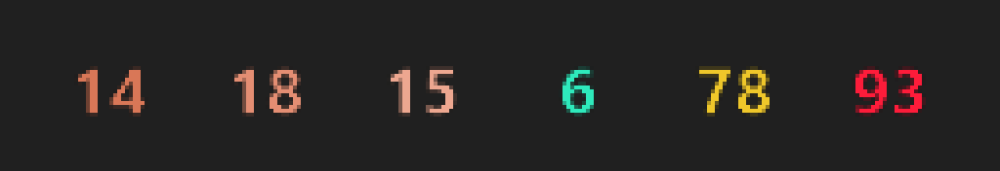
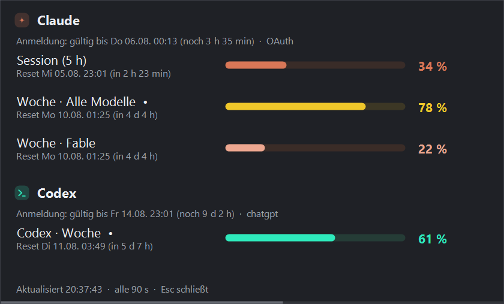
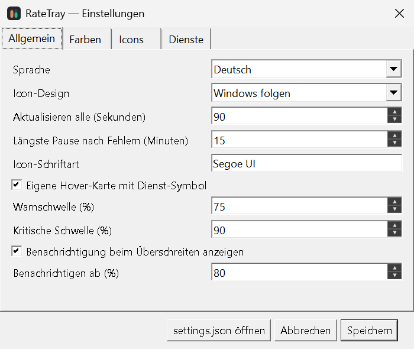
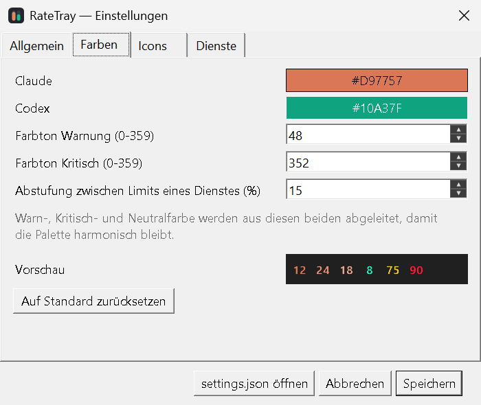

# RateTray

**Live-Auslastung der Limits von Claude Code und Codex — im Windows-Infobereich.**

Ein Icon pro Limit, gezeichnet wie Core Temp die CPU-Werte pro Kern anzeigt.

*[English version](README.md)*

> Geschrieben von Claude Code (Claude Opus 5) unter menschlicher Anleitung. Bitte
> [Entstehung](#entstehung) lesen, bevor du es auf deine Anmeldedaten loslässt.



Die Farbe sagt zweierlei gleichzeitig: unterhalb der Warnschwelle steht jede Zahl in der Farbe
ihres Dienstes (Terracotta = Claude, Grün = Codex), ab der Warnschwelle übernimmt die
Dringlichkeit für beide — erst Amber, dann Rot.

Linksklick auf ein beliebiges Icon öffnet das Detail-Fenster:



## Wozu

Beide CLIs können das verbleibende Kontingent anzeigen, aber nur innerhalb einer laufenden
Sitzung (`/usage` in Claude Code, `/status` in Codex). Hier stehen dieselben Zahlen dort, wo man
sie sieht, ohne etwas zu unterbrechen — und warnen, bevor man mitten in einer Aufgabe
anschlägt.

Die Werte sind **Live-Abfragen der offiziellen Limits**, keine Schätzung aus lokalen
Transcript-Dateien. Der Abruf kostet keine Modell-Token.

| Dienst | Quelle |
|---|---|
| Claude | `GET api.anthropic.com/api/oauth/usage`, mit dem Token, den Claude Code ohnehin speichert |
| Codex | `codex app-server` → JSON-RPC `account/rateLimits/read` |

## Voraussetzungen

- Windows 10 oder 11
- [.NET 9 Desktop Runtime](https://dotnet.microsoft.com/download/dotnet/9.0)
- Eine angemeldete Installation von Claude Code und/oder Codex CLI — eines von beiden genügt

## Installation

`RateTray.exe` aus dem [aktuellen Release](../../releases/latest) laden und starten, oder
selbst bauen:

```powershell
git clone https://github.com/nowrap/rate-tray.git
cd ratetray
dotnet publish src\RateTray\RateTray.csproj -c Release -r win-x64
```

Das Ergebnis ist eine einzelne Datei unter
`src\RateTray\bin\Release\net9.0-windows\win-x64\publish\`.

> **Windows 11 blendet neue Infobereich-Symbole zunächst aus.** Sie erscheinen erst hinter dem
> Pfeil `^`. Zum dauerhaften Anheften aus dem Überlauf auf die Taskleiste ziehen, oder unter
> *Einstellungen → Personalisierung → Taskleiste → Weitere Symbole in der Taskleiste*
> einschalten.

## Bedienung

| Aktion | Ergebnis |
|---|---|
| Mouseover | Karte mit Dienst-Symbol, aktuellem Wert und Reset-Zeit |
| Linksklick | Detail-Fenster: alle Limits, Reset-Zeiten, Gültigkeit der Anmeldung — und eine dezente Leiste an der Unterkante, die bis zur nächsten Aktualisierung läuft |
| Rechtsklick | Menü: Icons wählen, aktualisieren, Sprache, Autostart, Einstellungen |
| `Esc` | Detail-Fenster schließen |

Welche Icons erscheinen, wird **beim ersten Start aus deinem Konto ermittelt** — die Tarife
unterscheiden sich, und modellspezifische Fenster wie Fable gibt es nur bei manchen. Einzelne
Limits lassen sich unter *Rechtsklick → Icons* oder im Einstellungsdialog ab- und anschalten.

## Einstellungen

Rechtsklick → *Einstellungen öffnen*, oder `RateTray.exe --settings`.

<p align="center">
  
  
</p>

Der Farben-Reiter zeigt beim Ändern eine Live-Vorschau der echten Tray-Icons, abgeleitete
Palette inklusive.

Alles lässt sich auch direkt in `%APPDATA%\RateTray\settings.json` bearbeiten:

```jsonc
{
  "refreshSeconds": 90,       // Minimum 30 — der Usage-Endpunkt limitiert enge Schleifen
  "language": "auto",            // auto | en | de
  "theme": "auto",               // auto | light | dark — richtet sich nach der Taskleiste
  "richTooltips": true,          // eigene Hover-Karte; false = einfacher Windows-Tooltip
  "icons": [ "claude.session", "claude.weekly_all", "codex.primary" ],
  "iconsInitialized": true,      // auf false setzen, um die Limits neu zu ermitteln
  "maxBackoffMinutes": 15,     // längste Pause nach wiederholten Fehlern
  "thresholds":    { "warn": 75, "critical": 90 },
  "notifications": { "enabled": true, "atPercent": 80 },
  "colors": {
    "claude": "#D97757",
    "codex":  "#10A37F",
    "warnHue": 48,               // Amber
    "criticalHue": 352,          // Karmesin
    "warn": null,                // null = aus den beiden Dienstfarben abgeleitet
    "critical": null,
    "unknown": null,
    "shadeSpread": 0.15          // Abstufung zwischen Limits eines Dienstes; 0 = aus
  },
  "claude": { "enabled": true, "autoRefreshToken": false, "timeoutSeconds": 20 },
  "codex":  { "enabled": true, "executablePath": null, "timeoutSeconds": 30 }
}
```

### Farben

Direkt gewählt werden nur die beiden Dienstfarben. Warn-, Kritisch- und Neutralfarbe werden
daraus **abgeleitet**: Der Farbton ist gesetzt (Amber, Karmesin, Fast-Grau), Sättigung und
Helligkeit stammen aus dem gemeinsamen Ton der Dienstfarben. Wer eigene Markenfarben einsetzt,
bekommt eine mitziehende Palette statt eines festen Rots, das dann überall beißt.

Limits *desselben* Dienstes werden allein über die Helligkeit abgestuft, damit drei
Claude-Icons nebeneinander unterscheidbar bleiben, ohne die Markenfarbe zu verlassen. Ab der
Warnschwelle endet die Abstufung: darüber teilen sich alle Dienste und alle Limits ein Amber und
ein Karmesin — eine Warnung darf nicht davon abhängen, dass man die Palette kennt.

Vor der Ausgabe durchläuft jede Farbe eine Lesbarkeitsstufe, die die Helligkeit an das
Taskleisten-Design anpasst, ohne den Farbton anzutasten — eine dunkle Markenfarbe bleibt so auch
auf dunkler Leiste erkennbar.

## Wenn etwas schiefgeht

Ein fehlgeschlagener Abruf leert den Tray nicht. Die zuletzt eingetroffenen Werte bleiben
stehen, der Fehler wird daneben angezeigt, und der betroffene Dienst wird exponentiell
zurückgestellt — höchstens 15 Minuten. Nennt der Server ein `Retry-After`, gilt dessen Wert
statt der Schätzung, und das Detail-Fenster zeigt, wie lange die Pause noch läuft. Ein
Ratenlimit bekommt sofort die volle Pause statt sich dorthin hochzuarbeiten — ein
aufgebrauchtes Kontingent wird durch Nachfragen nicht besser.
*Jetzt aktualisieren* im Menü hebt sie auf.

Intervall, Backoff-Obergrenze und die Anfrage-Timeouts beider Dienste stehen im
Einstellungsdialog. Optionen, die eine neuere Version mitbringt, werden beim nächsten Start in
eine bestehende `settings.json` geschrieben — die Datei zeigt also immer alles Einstellbare.

Die letzten gültigen Werte liegen zusätzlich in `%APPDATA%\RateTray\cache.json`. Nach einem
Neustart stehen die Zahlen dadurch sofort da, statt einer Reihe `?` bis der erste Abruf durch
ist. Einträge älter als zwei Tage werden verworfen statt als aktuell ausgegeben.

## Anmeldung

Das Detail-Fenster zeigt pro Dienst, wie lange die Anmeldung noch gültig ist.

- **Claude** — Der Zugriffstoken hält wenige Stunden. Solange Claude Code läuft, erneuert es ihn
  auf der Platte und der Tray liest ihn nur neu. Ist er abgelaufen, sagt der Tray das.
  `claude.autoRefreshToken` lässt den Tray den Refresh selbst durchführen; die Option ist
  **standardmäßig aus**, weil dieser Pfad nicht gegen den echten Endpunkt erprobt ist.
  Schlägt er fehl, erscheint der Hinweis auf Claude Code und die Anmeldedatei bleibt unberührt.
- **Codex** — Der Zugriffstoken gilt rund zehn Tage. Danach `codex login` ausführen.

## Diagnose

```powershell
# Beide Provider einmal abfragen, alle verfügbaren Limit-IDs ausgeben, beenden.
# Die App ist ein GUI-Programm, daher Ausgabe umleiten statt `>` zu verwenden:
Start-Process .\RateTray.exe -ArgumentList "--once" -Wait -NoNewWindow `
  -RedirectStandardOutput out.txt ; Get-Content out.txt

.\RateTray.exe --details    # nur das Detail-Fenster
.\RateTray.exe --settings   # nur der Einstellungsdialog
```

`--once` gibt immer Englisch aus, unabhängig von der eingestellten Sprache — so lässt sich die
Ausgabe unverändert in ein Issue einfügen.

## Entwicklung

```powershell
dotnet build RateTray.sln
dotnet test tests\RateTray.Tests        # Unit-Tests, ohne Desktop lauffähig
dotnet test tests\RateTray.E2E          # startet die echte .exe; überspringt sich headless

pwsh tools\New-AppIcon.ps1                   # app.ico aus der Palette neu erzeugen
```

Siehe [CONTRIBUTING.md](CONTRIBUTING.md) — darunter, wie man eine Sprache ergänzt: eine
JSON-Datei, kein Code. In [docs/IDEAS.md](docs/IDEAS.md) stehen die offenen Fäden: Portierung
auf macOS und Linux, ein `--line`-Modus für tmux und Statusleisten, winget-Paketierung, und was
bislang ungetestet ist (englisch).

## Datenschutz

Die App spricht mit genau zwei Stellen: dem Usage-Endpunkt von Anthropic und einem lokalen
`codex app-server`-Prozess. Anmeldedaten werden aus den Dateien gelesen, die die offiziellen
CLIs ohnehin pflegen, und niemals kopiert, protokolliert oder anderswohin gesendet. Siehe
[SECURITY.md](SECURITY.md).

## Marken

Keine Verbindung zu Anthropic oder OpenAI, weder unterstützt noch gesponsert. „Claude" und
„Codex" benennen die Dienste, die dieses Werkzeug ausliest. Die Dienst-Symbole in der Oberfläche
sind selbst gezeichnete generische Formen, nicht die Logos der Unternehmen.

## Entstehung

Nahezu der gesamte Code, die Tests und die Dokumentation stammen von Claude Code (Claude
Opus 5), entstanden in einer Arbeitssitzung. Ein Mensch hat den Entwurf bestimmt, alle
Produktentscheidungen getroffen — Name, Farben, Schwellen, Lizenz — und die laufende App
geprüft.

Was das für dich als Leser bedeutet:

- 157 Unit-Tests und 9 End-to-End-Tests, alle grün, und die App lief gegen echte Claude- und
  Codex-Konten.
- **Es gab kein unabhängiges menschliches Code-Review.** Das Programm liest deine
  Anmeldedateien, also lies [SECURITY.md](SECURITY.md) — dort steht, welche Dateien angefasst
  werden und an welche einzige Adresse überhaupt etwas geht — und überflieg den Code, bevor du
  ihm vertraust.
- Mehrere Fehler wurden gefunden, indem jemand die App beim Fehlverhalten beobachtet hat, nicht
  durch Nachdenken über den Code. Der [Changelog](CHANGELOG.md) und die Commit-Nachrichten
  benennen das offen.

Commits tragen einen `Co-Authored-By`-Eintrag mit dem Modellnamen.

## Lizenz

[MIT](LICENSE)
