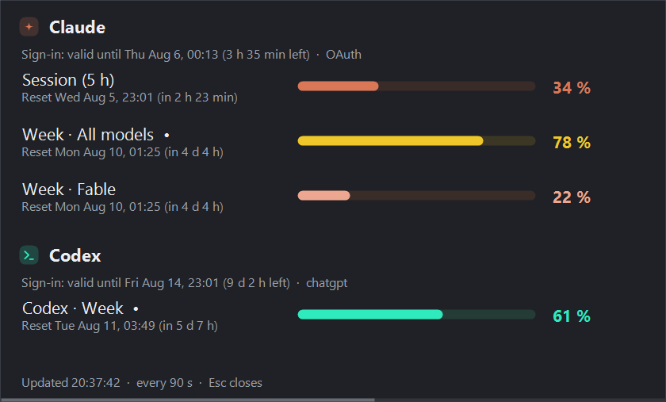
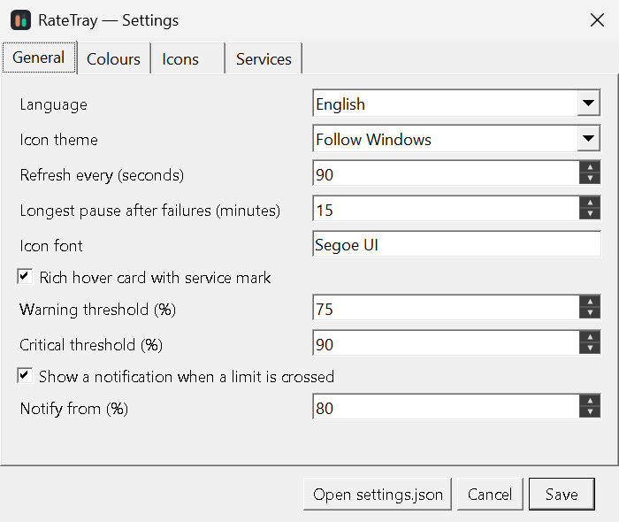
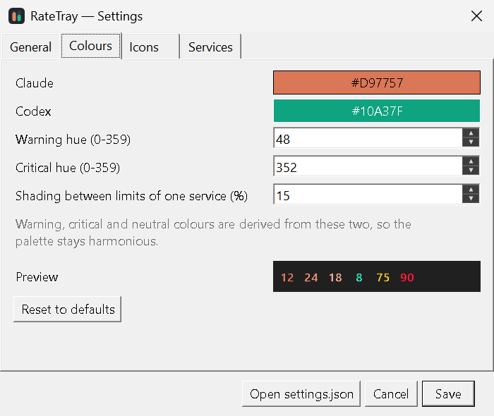

# RateTray

**Live usage limits for Claude Code and Codex, in the Windows tray.**

One icon per limit, drawn the way Core Temp shows per-core CPU values.

*[Deutsche Version](README.de.md)*

> Written by Claude Code (Claude Opus 5) under human direction. See [Provenance](#provenance)
> before you point it at your credentials.


Colour tells you two things at once: below the warning threshold each number is drawn in its
service's colour (terracotta = Claude, green = Codex); from the warning threshold on, severity
takes over for both — amber, then red.

Left-click any icon for the details panel:



## Why

The number already exists — it is just tedious to reach. It lives in the web apps, which is a
whole window away if you keep them parked in a webview shell like Rambox, and buried once you
get there: Claude moved usage back into settings, ChatGPT's was always in them. Either way,
checking means leaving what you were doing. Both CLIs can also show it, but only inside an
interactive session (`/usage` in Claude Code, `/status` in Codex). This puts the same numbers
where you can see them without interrupting anything, and warns you before you hit a wall
mid-task.

The values are **live server-side readings of the official limits**, not estimates
reconstructed from local transcript files — and fetching them costs no model tokens.

It started as a spontaneous experiment rather than a considered gap in the market. The
alternatives below turned up later, while looking into what a macOS or Linux port would take —
by which time this already existed, so none of them informed the decision to build it.

| Service | Source |
|---|---|
| Claude | `GET api.anthropic.com/api/oauth/usage`, using the token Claude Code already stores |
| Codex | `codex app-server` → JSON-RPC `account/rateLimits/read` |

## Requirements

- Windows 10 or 11
- [.NET 9 Desktop Runtime](https://dotnet.microsoft.com/download/dotnet/9.0)
- A signed-in Claude Code and/or Codex CLI installation — either one alone works

## Install

Download `RateTray.exe` from the [latest release](../../releases/latest) and run it, or
build from source:

```powershell
git clone https://github.com/nowrap/rate-tray.git
cd ratetray
dotnet publish src\RateTray\RateTray.csproj -c Release -r win-x64
```

The result is a single file under
`src\RateTray\bin\Release\net9.0-windows\win-x64\publish\`.

> **Windows 11 hides new tray icons by default.** They appear behind the `^` arrow until you
> drag them onto the taskbar, or enable them under
> *Settings → Personalisation → Taskbar → Other system tray icons*.

## Usage

| Action | Result |
|---|---|
| Hover | Card with the service mark, current value and reset time |
| Left-click | Details panel: every limit, reset times, sign-in validity, and a faint strip along the bottom edge counting down to the next refresh |
| Right-click | Menu: pick icons, refresh, language, autostart, settings, about |
| `Esc` | Close the details panel |

Which icons appear is **discovered from your account on first run** — plans differ, and
per-model windows such as Fable only exist for some. Turn individual limits on and off under
*right-click → Icons*, or in the settings dialog.

## Settings

Right-click → *Open settings*, or run `RateTray.exe --settings`.

<p align="center">
  
  
</p>

The colours tab previews the actual tray icons as you change them, derived palette included.

Everything is also editable directly in `%APPDATA%\RateTray\settings.json`:

```jsonc
{
  "refreshSeconds": 90,       // minimum 30 — the usage endpoint rate-limits a tight loop
  "language": "auto",            // auto | en | de
  "theme": "auto",               // auto | light | dark — matches the taskbar, not the app
  "richTooltips": true,          // own hover card; false = plain Windows tooltip
  "icons": [ "claude.session", "claude.weekly_all", "codex.primary" ],
  "iconsInitialized": true,      // set false to re-discover the limits on your account
  "maxBackoffMinutes": 15,     // longest pause after repeated failures
  "autoUpdateCheck": false,    // opt-in: check GitHub once a day for a new version
  "thresholds":    { "warn": 75, "critical": 90 },
  "notifications": { "enabled": true, "atPercent": 80 },
  "colors": {
    "claude": "#D97757",
    "codex":  "#10A37F",
    "warnHue": 48,               // amber
    "criticalHue": 352,          // crimson
    "warn": null,                // null = derived from the two service colours
    "critical": null,
    "unknown": null,
    "shadeSpread": 0.15          // how far limits of one service are shaded apart; 0 = off
  },
  "claude": { "enabled": true, "autoRefreshToken": false, "timeoutSeconds": 20 },
  "codex":  { "enabled": true, "executablePath": null, "timeoutSeconds": 30 }
}
```

### Colours

Only the two service colours are picked directly. Warning, critical and neutral are **derived**
from them: the hue is set (amber, crimson, near-grey) while saturation and lightness come from
the shared tone of the service colours. Swap in your own brand colours and the rest of the
palette follows instead of leaving a fixed red clashing with everything.

Limits of the *same* service are shaded apart by lightness alone, so three Claude icons in a row
are distinguishable without leaving the brand colour. Shading stops at the warning threshold:
above it every service and every limit shares one amber and one crimson, because a warning must
not depend on knowing the palette.

Every colour still reaches the screen through a legibility pass that lifts or lowers lightness
for the taskbar theme without touching hue — so a dark brand colour stays recognisable on a
dark taskbar.

## When something goes wrong

A failed poll does not blank the tray. The last readings that arrived stay on screen with the
error shown next to them, and that provider is backed off exponentially — capped at 15 minutes.
If the server states a `Retry-After`, that wins over the guess, and the details panel says how
long the pause still has to run. A rate limit goes straight to the longest pause instead of
climbing to it: a spent quota is not something retrying makes better. *Refresh now* in the menu clears the backoff.

The interval, the backoff ceiling and each service's request timeout are all in the settings
dialog. Options added by a newer version are written into an existing `settings.json` on the
next start, so the file always shows everything that can be set.

The last good readings are also cached to `%APPDATA%\RateTray\cache.json`, so a restart
shows numbers immediately instead of a row of `?` while the first poll runs. Entries older than
two days are discarded rather than presented as current.

## Sign-in

The details panel shows how long each sign-in is still valid.

- **Claude** — the access token lasts a few hours. While Claude Code is running it refreshes
  the token on disk and the tray simply re-reads it. If it has lapsed, the tray says so.
  `claude.autoRefreshToken` lets the tray perform the refresh itself; it is **off by default**
  because that path has not been exercised against the live endpoint. On failure it degrades to
  the "start Claude Code" hint and leaves the credentials file untouched.
- **Codex** — the access token lasts about ten days. After that, run `codex login`.

## Diagnostics

```powershell
# Poll both providers, print every limit id your account exposes, exit.
# The app is a GUI binary, so capture its output instead of using `>`:
Start-Process .\RateTray.exe -ArgumentList "--once" -Wait -NoNewWindow `
  -RedirectStandardOutput out.txt ; Get-Content out.txt

.\RateTray.exe --details    # only the fly-out
.\RateTray.exe --settings   # only the settings dialog
```

`--once` always prints English, whatever language is configured, so its output can be pasted
into an issue as-is.

## Development

```powershell
dotnet build RateTray.sln
dotnet test tests\RateTray.Tests        # unit tests, no desktop needed
dotnet test tests\RateTray.E2E          # drives the real .exe; skips itself when headless

pwsh tools\New-AppIcon.ps1                   # regenerate app.ico from the palette
```

See [CONTRIBUTING.md](CONTRIBUTING.md) — including how to add a language, which is one JSON
file and no code. [docs/IDEAS.md](docs/IDEAS.md) keeps the open threads: porting to macOS and
Linux, a `--line` mode for tmux and status bars, winget packaging, and what is still untested.

## Privacy

As shipped the app talks to two places: Anthropic's usage endpoint and a local `codex app-server`
process. An optional update check — off by default, enabled in the About dialog — adds one more:
GitHub, asked once a day for the tag list, with no token and nothing about you. Credentials are
read from the files the official CLIs already maintain and are never copied, logged or sent
anywhere else. See [SECURITY.md](SECURITY.md).

## Acknowledgements

The idea is lifted from [Core Temp](https://www.alcpu.com/CoreTemp/), which has been showing
per-core CPU temperatures as numbers in the notification area for years. RateTray does the same
thing for a different kind of budget.

## Alternatives

Both of these do far more than RateTray and are worth your attention first:

- [CodexBar](https://github.com/steipete/CodexBar) — macOS menu bar, 60+ providers, and a CLI
  for macOS and Linux.
- [Win-CodexBar](https://github.com/nesszer/Win-CodexBar) — Windows tray, 56 providers, browser
  cookie import, DPAPI credential storage, an installer, and a winget package.

Those are the deluxe version, and if you want a dashboard that is what you want. RateTray takes
the Core Temp approach instead: the value is drawn into the icon itself, so there is nothing to
open and nothing to click. 352 KB, two services, one idea.

## Trademarks

Not affiliated with, endorsed by or sponsored by Anthropic or OpenAI. "Claude" and "Codex" are
used to name the services this tool reads. The service marks drawn in the UI are generic shapes
written in code, not the companies' logos.

## Provenance

Nearly all of the code, tests and documentation here were written by Claude Code (Claude
Opus 5) in one working session. A human chose the design, made every product decision — name,
colours, thresholds, licence — and tested the running app.

What that means for you as a reader:

- There are 214 unit tests and 9 end-to-end tests, all passing, and the app has been run
  against live Claude and Codex accounts.
- **It has had no independent human code review.** It reads your credential files, so read
  [SECURITY.md](SECURITY.md) — it states exactly which files are touched and where anything is
  ever sent — and skim the code before you trust it.
- Several bugs were caught by watching the app misbehave rather than by reasoning about the
  code. The [changelog](CHANGELOG.md) and commit messages say so plainly.

Commits carry a `Co-Authored-By` trailer naming the model.

## Licence

[MIT](LICENSE)
